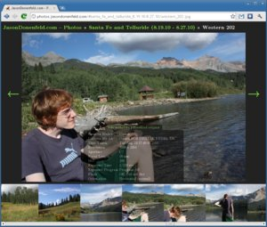

# PhotoFloat
### A Web 2.0 Photo Gallery Done Right via Static JSON & Dynamic Javascript
#### by Jason A. Donenfeld (<Jason@zx2c4.com>)

PhotoFloat is an open source web photo gallery aimed at sleekness and speed. It keeps with an old
hat mentality, preferring to work over directory structures rather than esoteric photo database
management software. Everything it generates is static, which means it's extremely fast.

[Check out a demo!](http://photos.jasondonenfeld.com/#santa_fe_and_telluride_8.19.10-8.27.10/western_202.jpg)

## How It Works

PhotoFloat consists of two segments – a Python script and a JavaScript application.

The Python script scans a directory tree of images, whereby each directory constitutes an album. It
then populates a second folder, known as the cache folder with statically generated JSON files and
thumbnails. The scanner extracts metadata from EXIF tags in JPEG photos. PhotoFloat is smart about
file and directory modification time, so you are free to run the scanner script as many times as you
want, and it will be very fast if there are few or zero changes since the last time you ran it.

The JavaScript application consists of a single `index.html` file with a single `scripts.min.js` and
a single `styles.min.css`. It fetches the statically generated JSON files and thumbnails on the fly
from the `cache` folder to create a speedy interface. Features include:

* Animations to make the interface feel nice
* Separate album view and photo view
* Album metadata pre-fetching
* Photo pre-loading
* Smooth up and down scaling
* Metadata display
* Consistant hash url format
* Linkable states via ajax urls
* Facebook meta tags for thumbnail and post type
* Link to original images (can be turned off)
* Optional Google Analytics integration
* Server-side authentication integration (respects HTTP status codes)
* A thousand other tweaks here and there...

It is, essentially, the slickest and fastest, most minimal but still well-featured photo gallery app on the net.

## Installation

#### Download the source code from the git repository:

    $ git clone https://github.com/pR0Ps/PhotoFloat.git
    $ cd PhotoFloat

#### Install the scanner package
Use the included `setup.py` to install the package. You will probably want to do this in a
[virtual environment](https://virtualenv.pypa.io/en/stable/).

    $ virtualenv -p python3 .venv
    $ source .venv/bin/activate
    $ pip install .

#### Install `exiftool`
`exiftool` is a tool that extracts EXIF data from a TON of image types. The scanner uses the command
line `exiftool` executable to process file metadata. In order for the scanner to work, the
`exiftool` executable needs to be available on the `$PATH`.

`exiftool` is widely packaged so installing it should be pretty simple:

    $ # Debian and derivitives:
    $ apt-get install libimage-exiftool-perl

    $ # OSX via brew:
    $ brew install exiftool

    $ # Arch Linux:
    $ pacman -S perl-image-exiftool

#### Install ImageMagick libraries
The scanner uses a Python library called `wand` to do all the processing of images. This library
requires the MagickWand v6 library to be installed on the system. See the
[wand install guide](http://docs.wand-py.org/en/latest/guide/install.html) for platform-specific
instructions details.

I had some issues getting Python to find the library on OSX 10.11.x. What finally solved them was
the following commands from [this comment](https://github.com/dahlia/wand/issues/141#issuecomment-274909365):

    $ brew install freetype imagemagick@6
    $ export MAGICK_HOME=/usr/local/opt/imagemagick@6

#### Change or delete the Google Analytics ID tracker:

To delete:

    $ rm web/js/999-googletracker.js

To change:

    $ vim web/js/999-googletracker.js

Modify the part that says UA-XXXXXX-X and put your own in there.

#### Tweak the index.html page to have a custom title or copyright notice.

    $ vim web/public/index.html

#### Build the web page.

Be sure you have nodejs installed. This will compile the webapp into the build folder.

    $ cd web
    $ npm install
    $ npm run build

#### Generate the albums:

Now in your public directory, let's make a folder for cache and a folder for the pictures:

    $ cd /path/to/PhotoFloat/web/public
    $ mkdir albums
    $ mkdir cache

When you're done, fill albums with photos and directories of photos. You can also use symlinks. Run
the static generator:

    $ photofloat albums
    $ # OR python -m /path/to/PhotoFloat/scanner -c cache albums

After it finishes, you will be all set. Simply have your web server serve pages out of your public
directory. You may want to do the scanning step in a cronjob.

## Notes on Access Control/Security:

The scanner generates thumbnails for images in the following format: `cache/thumbs/[1st 2 chars of
hash]/[rest of hash]_[size][square?].jpg`.

While this improves caching for user and reduces the space required on the server, it makes denying
access to specific image thumbnails very hard (without denying access to all the image thumbnails).

Since the names are not something easily-guessable (like an auto-incrementing number, for example),
the probability of guessing any valid URL is so close to 0 it might as well be a rounding error
(`1/(2^160-num_valid_files)`). However, since the names are generated from the file contents, this
scheme makes it *very* easy to confirm that a specific file exists. You simply hash your file in the
same way, build a URL using the result, then open it and see if it works.

For this reason, the option to salt the hashes with random data is available. This will prevent
anyone without the salt from checking if you're hosting a specific file on your server.

#### Optional: Getting salty

The `--salt` switch takes a file as a parameter. Then, when hashing the images to generate the
filenames, the data from the file is prepended to the image data, changing the final hash.

An example of generating a file with 16 bytes of random data in it, then using that data as the
salt:

    $ cd PhotoFloat
    $ head -c 16 /dev/urandom > .saltfile
    $ photofloat --salt .saltfile public/albums

#### Caveats

One of the major benefits to using this scheme is not having to generate duplicate images and serve
them to the user. This only works if the filenames stay consistent. The filenames only stay
consistent if the salt (or lack thereof) stays consistent.

For this reason, when adding/removing/changing the salt, it is advised to delete all the `*.json`
files in the cache directory before rescanning. This will force all the albums to be re-scanned and
have new thumbnails (using the new salt) generated. Extra images can automatically be cleaned up
when scanning completes by using the `--remove-stale` option

To be clear, everything will still work if the `*.json` files are not deleted first, but not as
optimally.

## Optional: Server-side Authentication

The JavaScript application uses a very simple API to determine if a photo can be viewed or not. If a
JSON file returns error `403`, the album is hidden from view. If an unauthorized album is directly
requested in a URL when the page loads, an authentication box is shown.

## Mailing List & Suggestions

If you have any suggestions, feel free to contact the PhotoFloat community via [our mailing
list](http://lists.zx2c4.com/mailman/listinfo/photofloat). We're open to adding all sorts of
features and working on integration points with other pieces of software.

## License

Copyright (C) 2010 - 2014 Jason A. Donenfeld. All Rights Reserved.

This program is free software; you can redistribute it and/or
modify it under the terms of the GNU General Public License
as published by the Free Software Foundation; either version 2
of the License, or (at your option) any later version.

This program is distributed in the hope that it will be useful,
but WITHOUT ANY WARRANTY; without even the implied warranty of
MERCHANTABILITY or FITNESS FOR A PARTICULAR PURPOSE.  See the
GNU General Public License for more details.

You should have received a copy of the GNU General Public License
along with this program; if not, write to the Free Software
Foundation, Inc., 51 Franklin Street, Fifth Floor, Boston, MA  02110-1301, USA.
